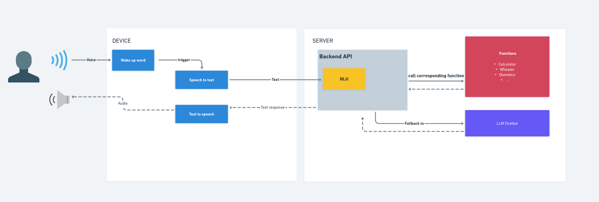

# Polyxia assistant

### Architecure



### Requirements
```bash
# If poetry is not installed
curl -sSL https://install.python-poetry.org | python3 -
```

## Installation 
```bash
git clone  ...
cd assistant
poetry install
```

Move .env.template to .env and fill the values

# Usage
```bash
poetry run python assistant/app.py
```


Polyxia is a voice assistant ...